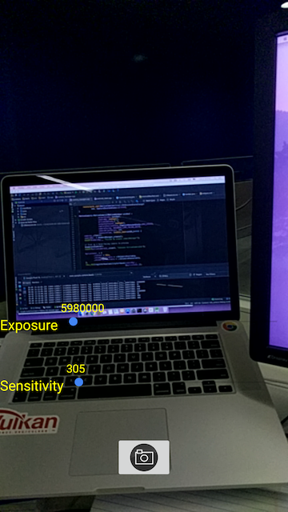

Native TensorFlow on Android
=============
The goal of this project was to implement a TensorFlow Lite interface in C++.
The motivation behind this project was to be able to access the Camera from an Android Device
and to process the data in TensorFlow using the same Native API.

The realisation of this project was made using a NdkCamera sample from Android to preview camera images with AReadImage.

Pre-requisites
--------------
- Android Studio 2.3.0+ with [NDK-r15+](https://developer.android.com/ndk/) bundle
- Android device running android-24+

Getting Started
---------------
1. Launch Android Studio

Screenshots
-----------
